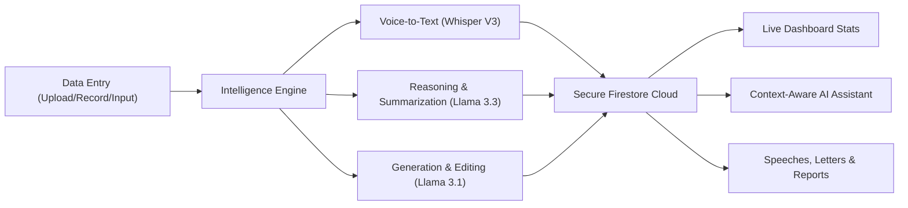

# Neeti AI: The Governance Intelligence OS


> **A high-performance command center for public leaders.**

Neeti AI is designed to help government officials, legislators, and administrators handle the daily complexities of governance. It transforms fragmented data—from meeting recordings and lengthy documents to constituency grievances—into a unified, actionable intelligence dashboard.

---

## The Product Workflow

The following diagram illustrates how Neeti AI processes information to provide clear insights for decision-making.



---

## Core Capabilities

### Strategic Dashboard
Get an immediate pulse on your jurisdiction. The dashboard summarizes mission-critical stats, tracks real-time activity, and highlights upcoming priorities. It is built to give leaders clarity at a glance.

### Meeting Intelligence
Stop worrying about manual note-taking. Record live meetings or upload audio to get instant transcripts, concise summaries, and clear action items. You can even "ask" your meetings specific questions to find decisions made months ago.

### Document Intelligence
Drown in paperwork no more. Upload complex PDFs or documents to extract key insights instantly. Our AI handles the heavy lifting of reading through circulars and reports, allowing you to focus on the numbers that matter.

### Constituency Command
Keep track of every grievance and infrastructure project in your ward. From entry to resolution, you can monitor the health of your constituency with detailed analytics and a comprehensive stakeholder directory.

### Legislative Speechwriter
Draft speeches, press statements, and formal letters in minutes. With built-in tone control and a rich text editor, you can generate professional drafts that match your voice and the occasion perfectly.

---

## Technical Architecture

Neeti AI is built on a modern, high-performance stack referred to as the **Zinc Architecture**.

- **Frontend**: A lightning-fast React 18 interface powered by Vite and styled with a custom Tailwind CSS system.
- **AI Inference**: Sub-second responses powered by Groq Cloud, utilizing Llama 3.3-70B for reasoning and Whisper-Large-V3 for speech processing.
- **Backend**: Real-time data synchronization and secure storage provided by Google Firebase (Firestore, Auth, and Storage).

---

## Getting Started

### 1. Environment Configuration
Create a `.env` file in your root directory and populate it with the following keys. These are essential for the AI, database, and communication features to function.

**Required Variables:**
```env
# AI & Inference (Groq Cloud)
VITE_GROQ_API_KEY=your_groq_key

# Backend & Database (Google Firebase)
VITE_FIREBASE_API_KEY=your_api_key
VITE_FIREBASE_AUTH_DOMAIN=your_project.firebaseapp.com
VITE_FIREBASE_PROJECT_ID=your_project_id
VITE_FIREBASE_STORAGE_BUCKET=your_project.firebasestorage.app
VITE_FIREBASE_MESSAGING_SENDER_ID=your_sender_id
VITE_FIREBASE_APP_ID=your_app_id

# Media Management (Cloudinary)
VITE_CLOUDINARY_CLOUD_NAME=your_cloud_name
VITE_CLOUDINARY_UPLOAD_PRESET=your_preset
VITE_CLOUDINARY_API_KEY=your_api_key

# Email Communications (EmailJS)
VITE_EMAILJS_SERVICE_ID=your_service_id
VITE_EMAILJS_TEMPLATE_ID=your_template_id
VITE_EMAILJS_ACCOUNT_DELETE_TEMPLATE_ID=your_delete_template_id
VITE_EMAILJS_PUBLIC_KEY=your_public_key
```

### 2. Local Deployment
```bash
# Clone the repository
git clone https://github.com/dear-asutosh/neeti-ai.git

# Install dependencies
npm install

# Start the development server
npm run dev
```

---

## Meet our Team 💝

| Name | LinkedIn |
| :--- | :--- |
| **Asutosh Sahoo** | [](https://www.linkedin.com/in/asutoshsahoo/) |
| **Jyoti Prakash Samal** | [](https://www.linkedin.com/in/jyotiprakashsamal/) |
| **Debasish Dash** | [](https://www.linkedin.com/in/debasish-dash-74b8b4244/) |
| **Rudra Narayan Jena** | [](https://www.linkedin.com/in/rudra-narayan-jena/) |

---

Built with precision for the leaders of today.