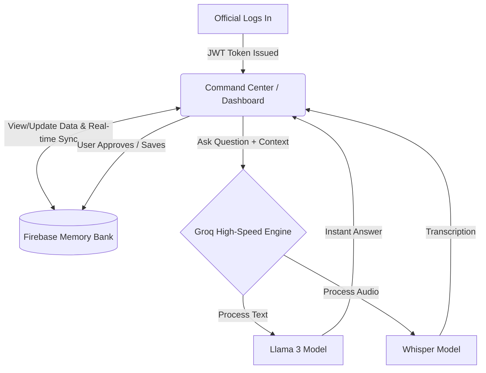
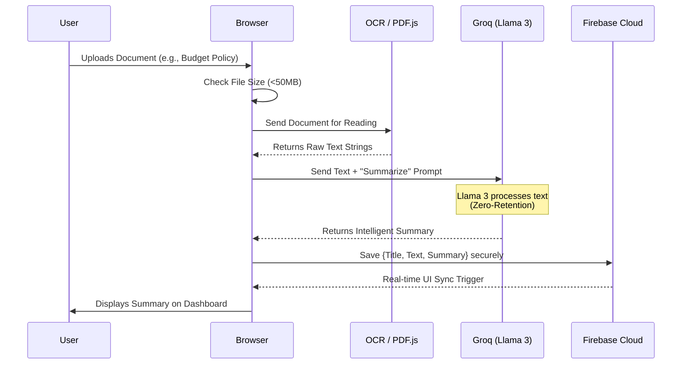
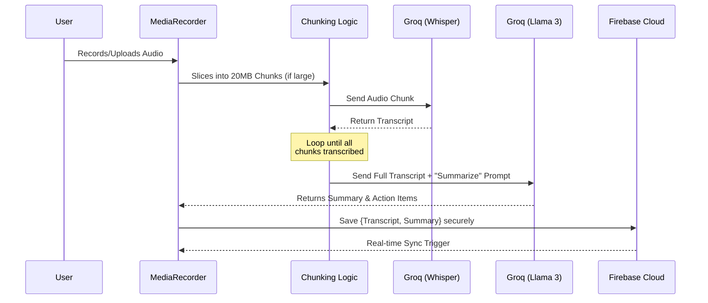

# Neeti AI FAQs

## 1. How does the full workflow of Neeti AI operate in simple terms, including the use of Firebase, Groq, AI Models, and JWT?

**Answer:**
Here is the full workflow of how Neeti AI works, explained in simple, everyday terms:

1. The Security Guard (Authentication & JWT)

When an official logs in, the system checks their identity.
It gives them a secure digital ID card (called a JWT or JSON Web Token). Every time they click a button or ask for data, they flash this digital ID card so the system knows it's really them and keeps their data strictly private.

2. The Command Center (The Frontend App)

This is the dashboard the official sees on their phone or laptop.
It displays everything: citizen complaints, meeting schedules, and project statuses. It’s where they type questions or upload documents.

3. The Central Memory Bank (Firebase / Google Cloud)

All notes, complaints, and user details are securely stored here.
Real-time magic: If a new complaint is filed, Firebase updates the official's dashboard instantly, without them even needing to refresh the page.

4. Gathering the Context (The "Smart" Step)

When the official asks the AI a question (like "Summarize Ward 5 issues"), the app doesn't just send the question blindly.
First, it reaches into Firebase to gather all the actual data about Ward 5. It bundles the question plus all that background context together.

5. The High-Speed Highway (Groq Engine)

The bundled question and context are sent to the AI.
Instead of waiting minutes for an answer, Groq acts as a super-fast engine that processes the request in milliseconds. It makes the AI feel instantaneous.

6. The Brains (The AI Models)

Once the data arrives, the specific "brains" go to work:
Llama 3: This is the reader and writer. It analyzes the Ward 5 data, figures out the main issues, and writes a clear summary.
Whisper: If the official recorded an audio memo, Whisper is the listener that types out exactly what was spoken in English or regional languages.
Importantly, these brains don't remember or store this data after they answer. They just process it and forget it (Zero-Retention).

7. The Return Trip & Action

The AI's answer immediately travels back to the official's screen.
The official reads the summary or draft. If they click "Save" or "Approve," the app sends that final document back to Firebase for permanent, safe storage.
In one sentence: You log in securely (JWT), view your info (Firebase), ask a question, and the system securely packages your specific data and sends it on a high-speed rail (Groq) to a super-smart brain (Llama/Whisper) that writes an instant answer and sends it right back to your screen.

**Workflow Diagram:**

## 2. What are the file size and data limits when using Groq's AI models, and how does the platform handle them to prevent crashes?

**Answer:**
Here are all the limits we are dealing with when using Groq's AI models, and exactly how we are handling them in the code right now:

### 1. Audio File Size Limits (Whisper API)
*   **The Limit:** Groq's `whisper-large-v3-turbo` model has a strict **25 MB** maximum file size limit for audio transcriptions. If we try to send a 1-hour recording at once, the API will reject it.
*   **How we handle it (in `Meetings.jsx`):** We play it safe by establishing a smaller safety limit in the code (`const CHUNK_SIZE = 20 * 1024 * 1024; // 20 MB API limit safety`). If an uploaded meeting recording exceeds 20 MB, a loop slices the audio file into 20 MB chunks (`file.slice`), transcribes each piece one after the other, and seamlessly stitches the final text together before the user even notices.

### 2. Document Size & Payload Limits (Llama Models)
*   **The Limit:** When uploading large PDFs sideways to the AI, we can hit "Payload Too Large" (HTTP 413) or hit token context window limits instantly.
*   **How we handle it (in `Documents.jsx`):** 
    1. First, we stop massive files at the door by hardcoding a 50 MB check (`file.size > 50 * 1024 * 1024`), showing a toast error "File size exceeds 50MB limit."
    2. During AI processing, if the chunk of text hits a strict Groq API Rate Limit, the code specifically catches errors containing `'413'` or `'Limit'`. It intercepts the crash and instead pops up a friendly `SweetAlert` saying "Document Too Large", suggesting the user try a smaller document.

### 3. Context Window Token Overflow
*   **The Limit:** Every AI model has a "Context Window" limit—the maximum number of words/tokens it can remember in a single prompt. If we feed a user's *entire* database history of complaints, projects, and meetings into one prompt, it guarantees a crash!
*   **How we handle it (in `AIAssistant.jsx` & Firebase Queries):** When the official asks the AIAssistant a general question, we don't dump their whole workspace. We use Firebase's `limit()` function to cap the context. For instance, we pull `limit(10)` for meetings, `limit(10)` for documents, and `limit(5)` for speeches. We only ever feed Groq the *most recent and relevant* pieces of knowledge, keeping the prompt lean and under the token threshold.

## 3. The problem statement mentions a broad "assistant that summarizes documents... tracks constituency data, manages schedules." But the app currently focuses heavily on Ward, People, and Budget/Project Management. How does Neeti AI address the needs of an administrator who doesn't explicitly manage those specific data types?

**Answer:**
This is part of the **"Modular MVP (Minimum Viable Product)"** strategy. 

*   **We Built the Hardest Part First:** Tracking complex relationships between people, budgets, and large-scale projects is universally the most data-heavy challenge in local administration. By successfully making the AI manage these datasets, we proved the hardest part of the architecture works. If the system can handle budget logic and ward demographics alongside unstructured meetings, it can easily handle simpler scheduling or inventory tasks.
*   **Neeti AI is a Modular Operating System:** Right now, "Constituency & Project Management" is the first module. Because the underlying system (Firebase + Groq) is modular, an official can plug in a new module tomorrow—like Hospital Capacity Tracking or Event Management—without rebuilding the AI engine. 
*   **The Core Intelligence is Already Universal:** The core AI features—summarizing documents, drafting speeches, and transcribing multi-lingual meetings—are already completely universal right out of the box. They support any administrative work, regardless of what goes in their tracking database.
*   **Customizable Terminology:** The framework is adaptable. What we call a "Project" can be relabeled as a "Department Initiative." What we call a "Ward" could be a "Health Zone." 

**In short:** We designed the AI to summarize any meeting or document universally, and we chose the complex Constituency Tracker as our initial proof-of-concept to prove our architecture can scale to any department's needs.

## 4. How can you claim that your model doesn't store any kind of sensitive data of the Government?

**Answer:**
When dealing with government data, "trust us" isn't good enough. You need technical proof. Here is exactly how Neeti AI guarantees it does not store or misuse sensitive government data:

### 1. The "Zero-Retention" AI Policy (Groq & Llama)
*   **The Claim:** The AI forgets everything the moment it answers.
*   **The Proof:** We do not use the free consumer web version of ChatGPT. We use the **Enterprise API from Groq**. Under their API Terms of Service, data sent for processing is explicitly **banned from being used to train public models**. It operates on a strict "Zero-Retention Policy"—the documents and context are held in the server's RAM for milliseconds to generate the answer, and then instantly wiped.

### 2. World-Class Secure Storage (Google Cloud)
*   **The Claim:** We aren't keeping your data on a random hard drive in someone's basement.
*   **The Proof:** Neeti AI's entire database runs directly on **Google Cloud Firestore**. This means the data is protected by the exact same encryption and security infrastructure that protects Gmail and Google Cloud, which are already trusted by governments globally. 

### 3. No "Middleman" Servers
*   **The Claim:** Our developers cannot intercept or read your data.
*   **The Proof:** Neeti AI's architecture connects the official's web browser *directly* to Google Cloud and the Groq API. We deliberately did not build a custom "middleman" backend server that could secretly log or copy the data as it passes through. 

### 4. 100% Auditor Transparent
*   **The Claim:** Don't take our word for it—check it yourself.
*   **The Proof:** Any technical auditor or IT administrator can open their browser's "Network Tab" while using Neeti AI. They will see that 100% of the data traffic flows exclusively to `firestore.googleapis.com` (Google) and `api.groq.com` (Groq). There are zero sketchy third-party endpoints or hidden tracking servers.

## 5. Why is there no Role-Based Access Control (multiple staff accounts) if public leaders don't typically do their own data entry?

**Answer:**
We deliberately did not build robust Role-Based Access Control (RBAC) intended for a large team of staff because the core goal of Neeti AI is to **eliminate the data entry bottleneck entirely.**

The assumption that a leader needs multiple staff members to do heavy data entry is the exact problem Neeti AI is designed to solve. With real-time voice transcription (Whisper) and instant AI document summarization (Llama), a leader doesn't need a Personal Assistant to spend 3 hours typing up meeting action items or summarizing a 400-page policy budget. 

The leader simply speaks into the app or uploads the document themselves. **Neeti AI *is* the Chief of Staff.** Building an infrastructure primarily designed for 10 staff members to manually log external data simply encourages the old, slow way of working. The system is built for the leader to operate directly and efficiently with zero middleman delays.

## 6. What exactly happens under the hood when an official uploads a document (like a PDF) for analysis?

**Answer:**
Here is the step-by-step workflow of how Neeti AI securely processes a document upload:

1. **Safety Check (The Gatekeeper):** The frontend first checks the file size. If it's over 50MB, it instantly blocks it to prevent the browser from crashing.
2. **Text Extraction (The Translator):** Instead of saving a heavy PDF file directly, the browser uses specialized tools (`pdf.js` for digital PDFs, or Tesseract OCR for scanned images) to pull all the raw text from the document, page by page.
3. **The High-Speed Dispatch (Groq Pipeline):** That raw text is bundled up with a prompt (e.g., "Summarize this budget report") and fired over a secure connection to the Groq API.
4. **The Brain Processing (Llama 3):** The `llama-3.3` model reads the text in milliseconds, extracts key action items or writes a comprehensive summary, and then immediately "forgets" the document (Zero-Retention Policy).
5. **The Safe Deposit (Firebase Cloud):** The final AI summary, along with the original extracted text and title, is saved directly into Google Cloud Firestore under the official's specific, secure User ID.
6. **Real-Time Delivery:** Firestore instantly pings the dashboard, sliding the newly processed document right into the recent files list without the user ever needing to refresh the page.

**Under-the-Hood Sequence Diagram:**

## 7. What exactly happens under the hood when an official records audio or uploads a meeting recording?

**Answer:**
Audio processing uses a slightly different "Ear-to-Brain" pipeline to handle large files. Here is the step-by-step workflow:

1. **Audio Capture (The Mic / Upload):** The browser uses its `MediaRecorder` API to listen to the microphone in real-time, or securely accepts an audio file upload (MP3, WAV, etc.).
2. **The Slicer (Chunking Logic):** Groq's transcription API has a strict 25MB limit. To prevent crashes, the app safely slices the audio file into 20MB "chunks."
3. **The Ear (Whisper Transcription):** Each 20MB chunk is sent sequentially to the `whisper-large-v3-turbo` model. Whisper translates the raw soundwaves into English or regional language text with near-perfect accuracy and instantly forgets the audio file.
4. **The Assembly Line:** The browser waits for all chunks to finish transcribing and seamlessly stitches the text back together into one massive transcript.
5. **The Brain (Llama 3):** Now that the text is assembled, the *entire* transcript is sent to the `llama-3.3-70b-versatile` text model, along with a prompt to "Generate Action Items, Summary, and Key Decisions."
6. **The Safe Deposit (Firebase Cloud):** Both the raw transcript and the polished AI summary/action items are securely saved to Google Cloud Firestore under the official's ID.
7. **Real-Time Delivery:** Just like documents, the meeting instantly appears on the dashboard for the official to review.

**Under-the-Hood Sequence Diagram:**

## 8. What are the core features and pillars of the Neeti AI platform that make it an indispensable tool for public leaders?

**Answer:**
Neeti AI is built on three core pillars: **AI Intelligence, Constituency Management, and Security**. Here is the master list of features that drive the platform:

### Pillar 1: AI Intelligence (The "Smart" Features)
1. **AI Meeting Summarizer:** Records live audio or accepts uploaded recordings. Uses Groq's Whisper API to transcribe the audio and Llama 3 to instantly pull out summaries and automatically log "Action Items" so nothing is forgotten.
2. **Document Intelligence (Docu-Chat):** Allows leaders to upload massive government circulars or heavy budget PDFs. The AI instantly extracts the key points, summarizes the jargon, and allows the official to "chat" with the document to find specific clauses without reading the whole thing.
3. **Multi-Lingual AI Speechwriter:** Generates highly personalized speeches, official letters, and public responses tailored to the specific event and audience tone. Crucially, it supports multiple regional Indian languages (Hindi, Bengali, Tamil, etc.).
4. **Global AI Assistant (The Command Node):** A chat interface that is grounded strictly in the leader's own data. It acts as a Chief of Staff—able to cross-reference past meetings, constituent profiles, and uploaded documents to give answers specific to that politician, rather than generic internet answers.

### Pillar 2: Constituency Management (The "Tracker" Features)
5. **Ward & People Directory:** A centralized CRM (Customer Relationship Management) system specifically designed for politics. It maps citizens to their specific wards and tracks demographic networks.
6. **Project & Budget Management:** Tracks ongoing infrastructure projects, their allocated budgets, and current completion statuses, giving leaders immediate oversight over where public money is moving.
7. **Real-Time Live Dashboard:** An instantly updating "Command Center" powered by Firebase. It gives a one-glance view of the daily schedule, recent documents, and the highest priority action items the second the leader logs in.

### Pillar 3: Infrastructure (The "Unfair Advantage" Features)
8. **Enterprise-Grade Security (Zero-Retention):** No government data is saved on unverified developer servers. The AI explicitly deletes all data immediately after processing, and the database runs entirely on Google Cloud's encrypted infrastructure with secure JWT Authentication.

## 6. Can we add the Google Translate option to the app, and how does it help?

**Answer:**
Yes, the Neeti AI platform is fully equipped with Google Translate integration directly built into the application interface. 

Because we are building for Bharat's public leaders—who oversee incredibly diverse linguistic populations—having instantaneous translation across the entire platform is essential. The Google Translate widget is available prominently in the navigation bar of both the public landing page and the official's private dashboard.

With a single click, an official or citizen can translate the entire Neeti AI interface, including complex AI-generated document summaries, meeting transcriptions, and constituency data, into Hindi, Bengali, Telugu, Marathi, Tamil, Urdu, Gujarati, Kannada, Odia, Malayalam, Punjabi, and more. This eliminates all language barriers between the AI's intelligent output and the local administrative staff.
